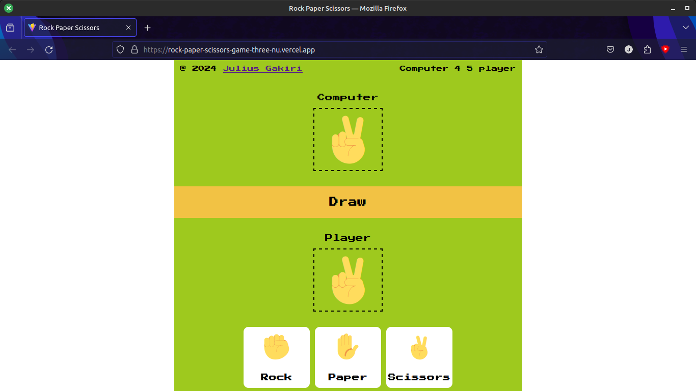

# Rock, Paper, Scissors Game

Welcome to the interactive Rock, Paper, Scissors game! This project allows you to play the classic hand game against the computer. The objective of the game is to select an option (Rock, Paper, or Scissors) and compare it with the computer's random choice to determine the winner based on the established rules:

- Rock wins against Scissors.
- Scissors wins against Paper.
- Paper wins against Rock.

## Live Demo

You can play the game here: [Rock, Paper, Scissors Game](https://rock-paper-scissors-game-three-nu.vercel.app/)

## Features

- Interactive user interface for selecting Rock, Paper, or Scissors.
- Randomized computer choice.
- Display of results indicating whether the player won, lost, or drew.
- Score tracking for both the player and the computer.
- Responsive design to ensure optimal gameplay experience on all screen sizes.

## Technologies Used

- HTML
- CSS
- JavaScript

## Screenshot



## Instructions

1. Clone the repository to your local machine:
   ```bash
   git clone https://github.com/Gakiri001/RockPaperScissorsGame.git
